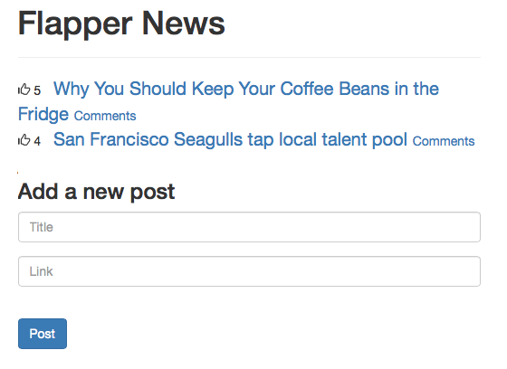
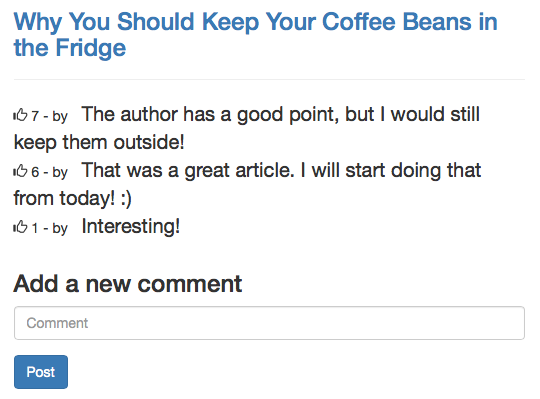

# angular-with-rails-thinkster

Using AngularJS and Rails to build a single-page application

[See the code.](flapper-news/)

## Project Specifications

* Create new posts
* View all posts ordered by upvotes
* Add comments about a given post
* View comments for a given post
* Upvote posts and comments
* Create a user authentication system using Devise

## Screenshots





## Installation

Run bundle to install all dependencies:

```
bundle install
```

Then, create and migrate the database:

```
bin/rake db:create db:migrate
```

Run the Rails server:

```
bin/rails s
```

The app will be available at [http://localhost:3000/](http://localhost:3000/)
